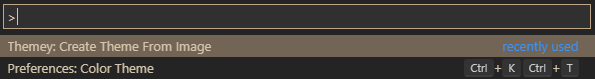
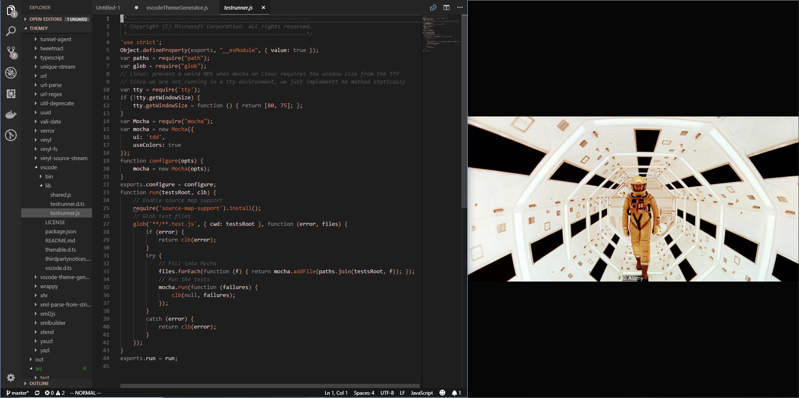
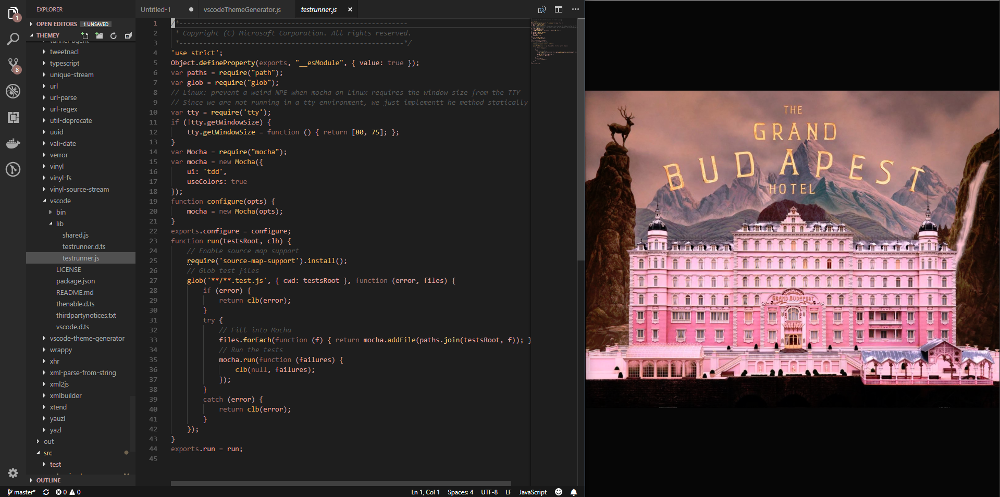
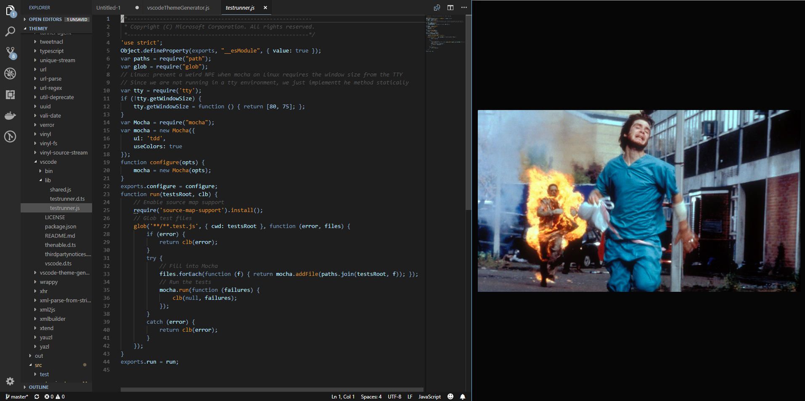
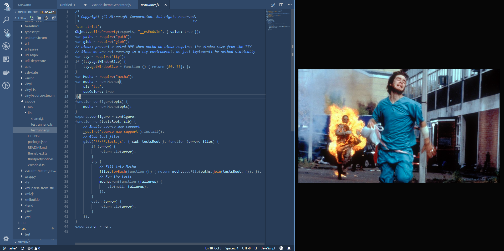
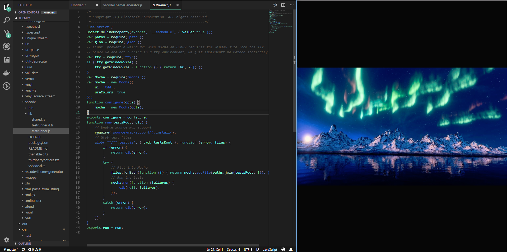
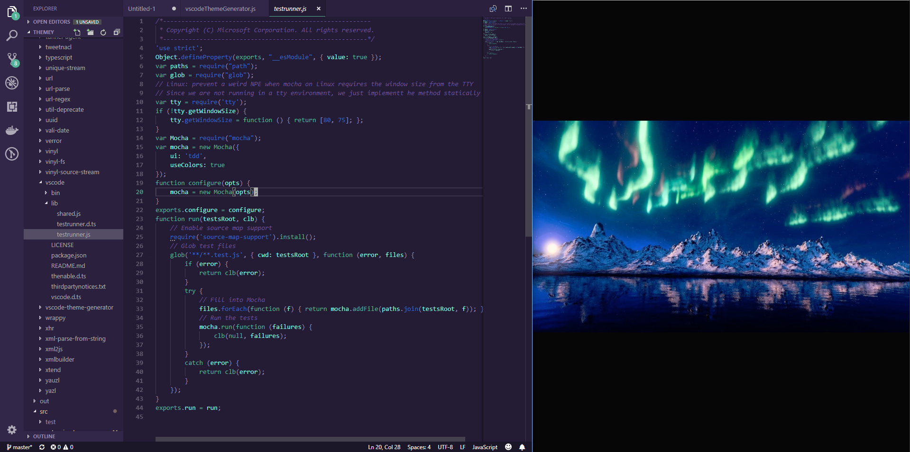

<h2 align="center">Themey</h2>

    
    
     

    

Create Themes from Images in <a href="https://code.visualstudio.com">Visual Studio Code</a>

  
---

---
<h3 align="center">Usage</h3>

Creating a theme is as easy as this:

* Open the Command Palette (ctrl/cmd+shift+p)

* Select "Themey: Create Theme From Image"

* Specify location of image

* Click 'Reload' on the prompt

---

<h3 align="center">Examples</h3>

# Themey

Themey takes an image and converts it into a theme for Visual Studio Code.

## Features

Creating a theme is as easy as this:

* Open the Command Palette (ctrl/cmd+shift+p)
* Select "Themey: Create Theme From Image"
* Specify location of image
* Click 'Reload' on the prompt

## Examples

## Known Issues

* Some themes don't generate all the palette colors required, so a default color is used in its place. This will be improved upon in the next update.

## Release Notes

### 1.0.0

Initial release of Themey.
