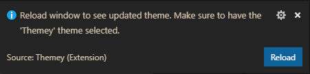

# Themey

Themey takes an image and converts it into a theme for Visual Studio Code.

## Features

Creating a theme is as easy as this:

* Open the Command Palette (ctrl/cmd+shift+p)
* Select "Themey: Create Theme From Image"
* Specify location of image
* Click 'Reload' on the prompt

## Examples

## Known Issues

* Some themes don't generate all the palette colors required, so a default color is used in its place. This will be improved upon in the next update.

## Release Notes

### 1.0.0

Initial release of Themey.
